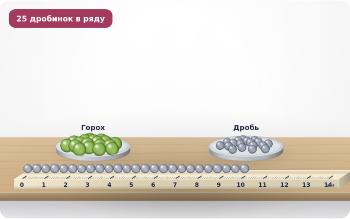
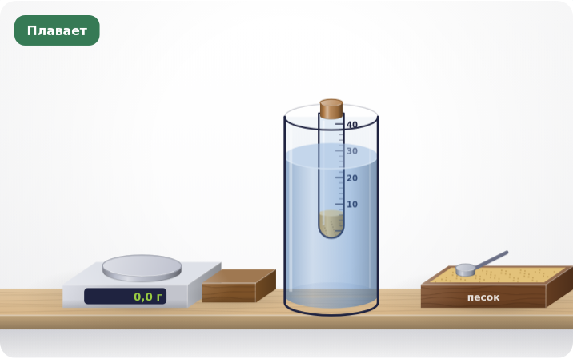
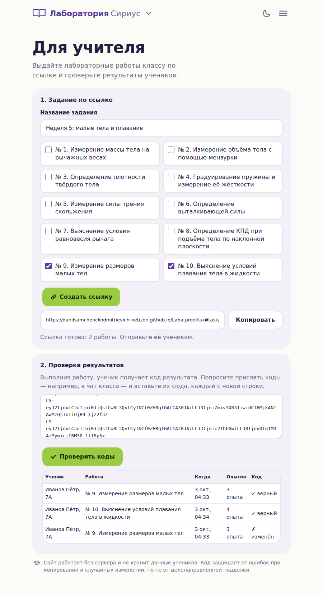

# Лаборатория Сириус — физика 7 класса

Сайт: https://danilsamchenckodmitrievich-netizen.github.io/Laba-proektx/

Один файл `index.html`, открывается в любом браузере без сборки и без сервера.

**Английская версия:** https://danilsamchenckodmitrievich-netizen.github.io/Laba-proektx/en/ — переключатель RU/EN в шапке.
Она собирается из `index.html` скриптом `python3 tools/build_en.py`: каждый русский фрагмент заменяется
переводом из `i18n/en.json`, код не меняется. После правок сайта запустите скрипт — он покажет новые фразы
без перевода.

* **Явления** — 19 интерактивных моделей с ползунками параметров.
* **Лабораторные работы** — 10 работ, где приборы и тела перетаскиваются мышью или пальцем:
  1. Измерение массы тела на рычажных весах
  2. Измерение объёма тела с помощью мензурки
  3. Определение плотности твёрдого тела
  4. Градуирование пружины и измерение её жёсткости
  5. Измерение силы трения скольжения
  6. Определение выталкивающей силы
  7. Выяснение условия равновесия рычага
  8. Определение КПД наклонной плоскости
  9. Измерение размеров малых тел (метод рядов)
  10. Выяснение условий плавания тела в жидкости

  Кнопка «Записать измерение» запоминает опыт, а показания приборов ученик читает по шкале сам
  (весы, мензурка, линейка, динамометр с делениями 0,1 Н) и вписывает в клетки с пунктирной рамкой;
  принимается ответ с точностью до одного деления. Если по 3D-картинке трудно понять уровень,
  кнопка «Измерить» показывает показания под установкой, но в таблицу их не вписывает. Вычисления ученик тоже вписывает сам, а «Проверить
  работу» проверяет показания, расчёты и вывод.
* **Лупа** — кнопка в работе увеличивает место шкалы под пальцем или курсором.
* **Неизвестное вещество** — в работе «Плотность» цилиндры без подписей: по своей плотности и
  таблице плотностей ученик определяет, из чего сделано каждое тело.
* **Свой вариант у каждого ученика** — при каждом открытии работы размеры тел и свойства приборов
  немного другие, поэтому числа в таблице у всех свои. Показания, которые записывает кнопка, изменить
  нельзя — проверка это покажет.
* **График по таблице** — в 7 работах точки опытов сразу ложатся на график (закон Гука, трение,
  плотность, рычаг, КПД, метод рядов, условия плавания); вопрос под графиком подводит к выводу.
* **Мини-тест** — 3 вопроса после каждой работы; ответы фиксируются при первой проверке, результат
  попадает в код для учителя.
* **Точность измерений** — ученик определяет цену деления прибора и погрешность и получает результат
  в виде «V₂ = 120 ± 1 мл».
* **Подсказки к ошибкам** — проверка объясняет, что не так: значение в 1000 раз больше верного,
  делимое и делитель перепутаны, не то округление.
* **На весь экран** — установку можно показать на проекторе (кнопка «На весь экран»).
* **Без интернета** — сайт устанавливается на телефон значком и работает офлайн
  (manifest.webmanifest и sw.js).
* **Отчёт (PDF)** — кнопка на странице работы печатает оформленный отчёт: цель, оборудование,
  таблица, вывод; в окне печати выберите «Сохранить как PDF».
* **Классы и коды учеников (сервер)** — учитель регистрируется по приглашению от авторов проекта,
  создаёт классы и добавляет учеников (только имя). Каждый ученик получает личный код из 6 знаков и
  входит по нему на странице «Лабораторные работы»; один код работает на одном устройстве.
  Лабораторные работы закрыты, пока учитель не откроет их классу (можно со сроком сдачи); модели
  явлений открыты всем. Результаты сами приходят в журнал класса, он обновляется каждые 10 секунд;
  одинаковые показания у разных учеников и слишком быстрое выполнение отмечаются. Демо-код на
  15–90 минут создаётся только в кабинете учителя, результаты в демо-режиме не сохраняются.
  Администраторы (авторы проекта) выдают приглашения, блокируют учителей и выдают временные пароли.
  Устройство сервера и перенос на другой хостинг — в [server/README.md](server/README.md).
  Если сервер недоступен, сайт работает как раньше: работы открыты, результат передаётся кодом.
* **Без сервера: для учителя** (`#teacher`, раздел «Без интернета») — ссылка-задание с выбранными работами и проверка кодов
  результатов. По ссылке ученик сразу попадает в первую работу задания, видит только заданные
  работы и после каждой проверки переходит к следующей; все коды собираются в одном месте. Ученик вписывает имя, после успешной проверки работы получает код и отправляет
  его учителю. Сервера нет: задание хранится в самой ссылке, а код защищён контрольной суммой
  от ошибок копирования (но не от целенаправленной подделки). В коде записаны показания приборов,
  поэтому учитель видит числа ученика, а одинаковые числа у разных учеников отмечаются.
  Проверенные коды сохраняются в журнале класса на устройстве учителя; журнал можно скачать для Excel.

| Метод рядов | Условия плавания |
|---|---|
|  |  |

Проверено в Chromium (компьютер и экраны телефонов 360–412 px, светлая и тёмная темы).
Для старых Safari добавлена замена `roundRect`.
